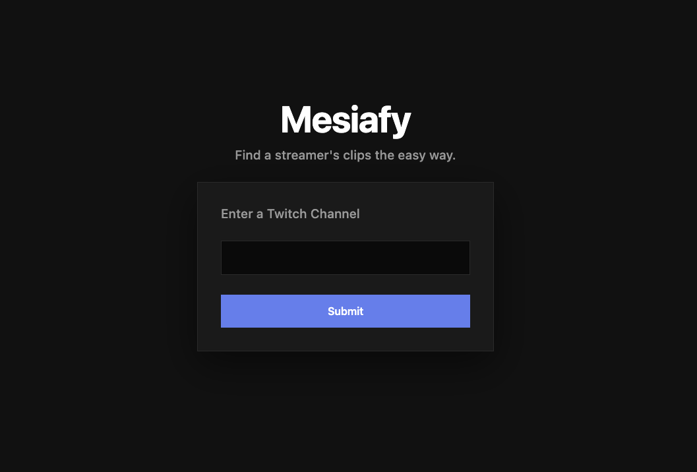
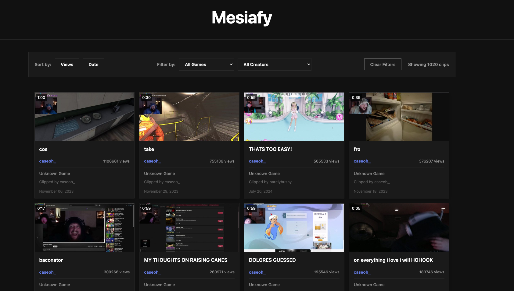

# Mesiafy

**Browse Twitch clips with style.**

Mesiafy is a web app that lets you view all clips from any Twitch channel in a clean, modern interface. No ads, no clutter — just clips.

**Live at:** https://mesiafy.com

---

## Screenshots

### Home Page

### Channels Page

---

## Features

### Browse Any Channel
Enter any Twitch channel name and instantly see all their clips in a responsive grid layout.

### Sort Clips
- **By Views**: Toggle between ascending (least viewed first) and descending (most viewed first)
- **By Date**: Toggle between newest first and oldest first

### Filter Clips
- **By Game**: See only clips from specific games
- **By Creator**: See only clips from specific users
- Combine filters for precise searches

### Easy Navigation
- **Pagination**: Browse through clips 20 at a time
- **Quick Jump**: First, Previous, Next, and Last page buttons
- **Shareable URLs**: Direct links to any channel (e.g., `mesiafy.com/ninja`)

### Clip Details
Each clip card shows:
- Clickable thumbnail (opens clip on Twitch)
- Duration timestamp
- Title
- Streamer name
- View count
- Game name
- Creator name
- Upload date

---

## How to Use

1. **Visit** https://mesiafy.com
2. **Enter** a Twitch channel name (e.g., "shroud", "ninja", "xqc")
3. **Browse** clips with sorting and filtering options
4. **Click** any thumbnail to watch on Twitch

---

## Tech Stack

Built with:
- **Backend**: Flask (Python)
- **Frontend**: Vanilla JavaScript (no frameworks)
- **API**: Twitch Helix API
- **Deployment**: Docker + nginx on AWS EC2
- **SSL**: Let's Encrypt

---

## About

Mesiafy was created as a learning project to explore web development, API integration, and cloud deployment. The goal was to build a simple, fast, and beautiful way to browse Twitch clips.

---

## Feedback

Found a bug or have a feature request? [Open an issue](https://github.com/yourusername/twitch-clip-app-new/issues) on GitHub.

---

**Enjoy browsing clips!**
